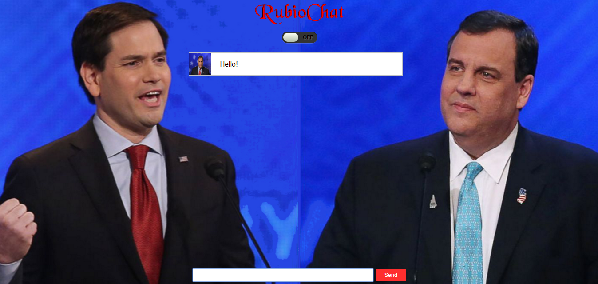

# RubioChat

RubioChat is an exclusive, engaging new way to communicate with Florida Senator Marco Rubio. 

# Special Thanks

RubioChat borrows heavily from [MyChat], a simple HTML5 chat client built upon the Spike Engine. Needless to say, the server-side functionality has been stripped out. Sound is handled by [SoundManager 2].

###### Disclaimer

This website is in no way an endorsement or opposition of the persons displayed.

[//]: # (These are reference links used in the body of this note and get stripped out when the markdown processor does its job. There is no need to format nicely because it shouldn't be seen. Thanks SO - http://stackoverflow.com/questions/4823468/store-comments-in-markdown-syntax)

   [MyChat]: <http://www.spike-engine.com/samples/html5-chat>
   [SoundManager 2]: <http://www.schillmania.com/projects/soundmanager2/>
